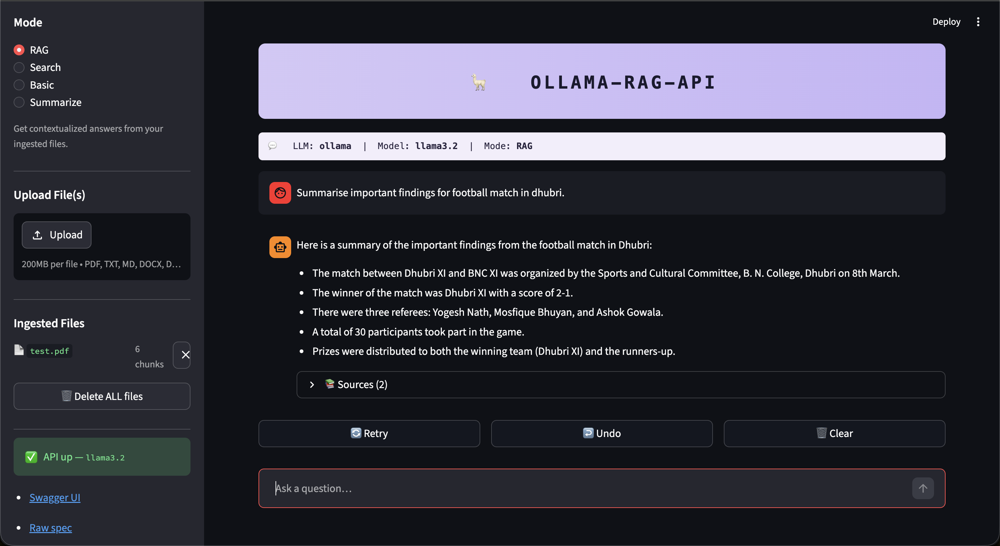
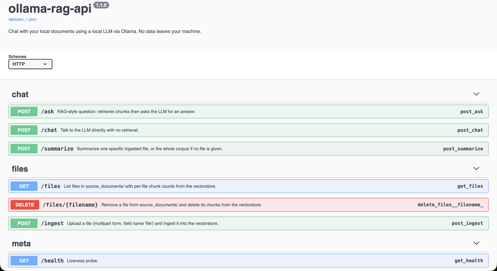

# ollama-rag-api

[](https://www.python.org/)
[](https://flask.palletsprojects.com/)
[](https://www.langchain.com/)
[](https://www.trychroma.com/)
[](https://ollama.com)
[](https://www.docker.com/)
[](LICENSE)

**A local RAG REST API with a reference Streamlit UI. Chat with your documents — nothing leaves your machine.**

An eight-endpoint **Flask REST API** for retrieval-augmented chat over your own documents, served alongside a Streamlit reference UI. Drop documents into a folder, embed them into Chroma, and query them via the API in four modes (RAG, direct chat, search-only, summarize), with full file management (upload, list, delete) so any client — curl, Postman, Python, a custom frontend, or the bundled Streamlit app — can drive the whole experience. Ships with interactive Swagger docs at `/apidocs` and a Docker setup that runs the whole stack in one container.

<p align="center">
  
</p>

## Use as a boilerplate

This repo doubles as a working reference for local-RAG patterns. Three ways to use it:

- **As a backend** — drop the API behind any chat frontend, CLI, or workflow tool. Eight HTTP endpoints, OpenAPI spec at `/apispec_1.json`, Postman collection in [examples/](examples/).
- **As a learning artifact** — clean, well-scoped Flask app ([api.py](api.py)) and ingest pipeline ([ingest.py](ingest.py)) that show RAG end-to-end: chunking → embeddings → Chroma → retrieval → LLM. No framework abstractions in the way.
- **As a fork-and-customize starter** — swap the LLM, embeddings, or vector store via env vars; add endpoints or file loaders in two places. See [Extending this](#extending-this).

---

## Architecture

```
                                     ┌──► Chroma vectorstore
  Streamlit chat UI ─┐        Flask  │
                     ├─► /ask, /chat, /summarize  ──► LangChain ──┤
  curl / Postman /  ─┘    /files (GET/POST/DELETE)                │
  python_client.py        /health, /apidocs                       └──► Ollama LLM
```

---

## Quick start (local)

**Prereqs:**

- **Python 3.11+**
- **[Ollama](https://ollama.com)** installed and running. macOS: `brew install ollama && ollama serve` (or launch the menu-bar app). Linux: `curl -fsSL https://ollama.com/install.sh | sh && ollama serve`.
- ~3 GB free disk for the default model + embeddings model

**Steps:**

```bash
git clone https://github.com/yashyaadav/ollama-rag-api.git
cd ollama-rag-api

make install      # creates .venv and installs Python deps
make ollama       # ollama pull llama3.2 (~2 GB, one-time; skip if already pulled)
make ingest       # embed source_documents/ into db/ (a demo test.pdf ships in the repo)
make run          # API on :5001, Streamlit UI on :8501
```

`make help` lists every target.

### Your first query

After `make run` shows `Running on http://127.0.0.1:5001` **and** Streamlit prints
its URL, give the API ~10 seconds to finish its first-time LangChain init, then:

1. Open **http://localhost:8501** — you'll see the Streamlit UI.
2. The sidebar should show **✅ API up — llama3.2** under "API". If it shows
   ❌ unreachable, the API is still booting — click **🔄 Recheck** or wait a few
   seconds and reload.
3. In the sidebar you'll see **test.pdf — 6 chunks** under "Ingested Files".
   Type a question into the chat input (e.g. *"What is this document about?"*)
   and hit Enter.
4. The answer appears with an expandable **📚 Sources** section listing the
   chunks the LLM used.
5. To use your own corpus: drag-and-drop files into the sidebar's **Upload
   File(s)** panel and click **Ingest uploaded**. They appear in the list with
   a per-file delete (✕) and a chunk count.

Prefer the API directly? `curl http://localhost:5001/health` then jump to the
[API reference](#api-reference) below.

---

## Quick start (Docker)

**Prereqs:** Docker Desktop (or any Docker engine).

```bash
make docker       # builds the image, then runs it with 5001 / 8501 / 11434 exposed
```

The container runs Ollama, pulls the model lazily if missing, ingests
`source_documents/` only when it has content and no `db/` exists, then serves
the API and Streamlit. Mount your own `source_documents/` and `db/` as volumes
(the Makefile does this for you).

> **First build is slow** (~5 min) because it has to pull `python:3.11-slim`,
> install build tools, and download the Ollama installer. Subsequent builds
> reuse layers.
>
> **macOS gotcha:** if you already have host Ollama running on port `11434`,
> `make docker-run` will fail with *"port already allocated"*. Either stop the
> host daemon (`pkill -f "ollama serve"` or quit the menu-bar app) or skip the
> `-p 11434:11434` mapping — the container has its own internal Ollama.

---

## API reference

Eight endpoints across three groups. Interactive playground with "Try it out"
is at **http://localhost:5001/apidocs**; the raw OpenAPI spec lives at
`/apispec_1.json`. The full request/response shapes are also captured in
`examples/postman_collection.json`.

<p align="center">
  
</p>

| method | path                  | purpose                                              |
|--------|-----------------------|------------------------------------------------------|
| GET    | `/health`             | Liveness probe                                       |
| POST   | `/ask`                | RAG: retrieve + answer with sources                  |
| POST   | `/chat`               | Talk to the LLM directly, no retrieval               |
| POST   | `/summarize`          | Summarize one file or the whole corpus               |
| GET    | `/files`              | List ingested files + per-file chunk counts          |
| POST   | `/ingest`             | Upload a file (multipart) and add it to the corpus   |
| DELETE | `/files/<name>`       | Remove a file and its chunks from the vectorstore    |

### Meta

#### `GET /health`

```bash
$ curl -s http://localhost:5001/health
{"status":"ok","model":"llama3.2"}
```

### Chat modes

#### `POST /ask`  — RAG

Retrieves the top-`TARGET_SOURCE_CHUNKS` chunks and asks the LLM for a grounded answer.

```bash
curl -X POST http://localhost:5001/ask \
  -H 'Content-Type: application/json' \
  -d '{"query":"What is this document about?"}'
```

Returns `{query, answer, time_taken, documents: [{source, content}]}`. Duplicate
chunks are removed; only unique `(source, content)` pairs are returned.

#### `POST /chat`  — no retrieval

```bash
curl -X POST http://localhost:5001/chat \
  -H 'Content-Type: application/json' \
  -d '{"query":"Explain RAG in one sentence."}'
```

Returns `{query, answer, time_taken}`. Faster than `/ask` (skips embedding +
similarity search).

#### `POST /summarize`  — whole-doc summary

```bash
# one file
curl -X POST http://localhost:5001/summarize \
  -H 'Content-Type: application/json' \
  -d '{"file":"test.pdf"}'

# everything
curl -X POST http://localhost:5001/summarize \
  -H 'Content-Type: application/json' \
  -d '{}'
```

Returns `{file, answer, chunks_used, truncated, time_taken}`. Concatenated
chunks are clipped at 16 000 chars before being sent to the LLM (the `truncated`
flag tells you when that happened).

### File management

#### `GET /files`

```bash
$ curl -s http://localhost:5001/files
{"files":[{"name":"test.pdf","size_bytes":141013,"chunks":6}]}
```

#### `POST /ingest`  — multipart upload

```bash
curl -X POST http://localhost:5001/ingest \
  -F 'file=@/path/to/your-doc.pdf'
```

Returns `{file, chunks_added, time_taken}`. Supported types match the list in
[Supported document types](#supported-document-types). The file is rolled back
from disk if embedding fails, so a failed upload leaves no orphans.

#### `DELETE /files/<name>`

```bash
curl -X DELETE http://localhost:5001/files/test.pdf
```

Returns `{deleted, chunks_removed, file_removed}`. Removes both the file from
`source_documents/` and its chunks from Chroma (filtered by `metadata.source` —
no full re-ingest needed).

### Other clients

```bash
http POST :5001/ask query="What is this document about?"   # httpie
python examples/python_client.py "What is this document about?"
```

Postman: import `examples/postman_collection.json`, set the `API_URL`
variable, and hit any request.

---

## Streamlit UI

A chat frontend at http://localhost:8501. The sidebar groups everything you
need: mode selector, file upload, ingested-files list with per-row delete,
and a live API-health indicator with links to Swagger and the raw OpenAPI
spec. Each assistant turn has an expandable **📚 Sources** section listing
the retrieved chunks so you can verify the answer is grounded.

### Modes

| Mode        | What it does                                      | Backend endpoint |
|-------------|---------------------------------------------------|-------------------|
| **RAG**     | Default. Retrieves chunks then asks the LLM       | `POST /ask`       |
| **Search**  | Returns retrieved chunks only — no LLM synthesis  | `POST /ask` (response renders sources only) |
| **Basic**   | Talk to the model directly, no retrieval (~2s)    | `POST /chat`      |
| **Summarize** | Summarize one file or the whole corpus (uses a button, not chat input) | `POST /summarize` |

Below the chat input: **🔄 Retry** re-fires the last question with the
current mode, **↩️ Undo** removes the last exchange, **🗑️ Clear** wipes
the history.

Reads `API_URL` from the env (defaults to `http://localhost:5001`), so it
points at either the local Flask process or a Dockerised API.

---

## Configuration

All values are env vars; defaults are sensible. See `.env.example`.

| variable                | default              | purpose                                     |
|-------------------------|----------------------|---------------------------------------------|
| `MODEL`                 | `llama3.2`           | Ollama model name                           |
| `EMBEDDINGS_MODEL_NAME` | `all-MiniLM-L6-v2`   | HuggingFace sentence-transformers model     |
| `PERSIST_DIRECTORY`     | `db`                 | Where Chroma persists the vector store      |
| `TARGET_SOURCE_CHUNKS`  | `4`                  | Chunks retrieved per query                  |
| `PORT`                  | `5001`               | Port the Flask API binds to                 |
| `API_URL`               | `http://localhost:5001` | Where the UI/examples reach the API     |
| `FLASK_DEBUG`           | `0`                  | `1` enables Flask debug — **never in prod** |

---

## Supported document types

`.csv`, `.doc`, `.docx`, `.enex`, `.eml`, `.epub`, `.html`, `.md`, `.odt`,
`.pdf`, `.ppt`, `.pptx`, `.txt`.

Drop files into `source_documents/` and run `make ingest`. Re-running adds
only new files; the existing vector store is preserved.

---

## Examples

Everything lives under `examples/`:

- `curl.sh` — single-shot curl POST to `/ask`, JSON-safe quoting + jq
- `httpie.sh` — same in HTTPie syntax (`brew install httpie` if you don't have it)
- `python_client.py` — minimal `ChatClient` with `health()` and `ask()`; run from inside the project venv: `.venv/bin/python examples/python_client.py "..."`
- `postman_collection.json` — Postman v2.1 collection (importable)

---

## Security

This is a **local-only** project by design — there is no authentication on
any endpoint and the API binds to `0.0.0.0` so it's reachable from your LAN.
Anyone who can reach the port can call `/ingest`, `/ask`, `DELETE /files/<name>`,
or read every chunk in your vectorstore.

**Don't expose it directly to the internet.** If you need to:

- Bind it to localhost only: edit `api.py` and change `host="0.0.0.0"` to `host="127.0.0.1"`.
- Or front it with a reverse proxy (Caddy / nginx) that adds basic auth or a bearer token.

Setting `FLASK_DEBUG=1` enables the Werkzeug debugger, which allows remote code
execution if the port is reachable — never enable in production.

---

## Troubleshooting

- **Streamlit sidebar shows ❌ API unreachable on first load** — the API's
  ~10 s cold start (LangChain + HuggingFace embeddings init) hasn't finished.
  Click **🔄 Recheck** in the sidebar, or wait a few seconds and reload.
- **`/health` returns `500` / connection refused** — Ollama isn't running.
  `ollama serve` in another terminal (the Docker setup handles this for you).
- **Port already in use** — override with `PORT=5050 make api` (Flask) or
  `make ui -- --server.port 8600` (Streamlit). Default ports: `5001` (API),
  `8501` (UI), `11434` (Ollama).
- **macOS `Address already in use` on 5000** — that's why the API defaults
  to `5001`. macOS Monterey+ binds port 5000 for AirPlay Receiver. You can
  either keep `5001` (recommended) or disable AirPlay Receiver in
  *System Settings → General → AirDrop & Handoff*.
- **Docker: `Cannot connect to the Docker daemon`** — Docker Desktop isn't
  running. Launch it, wait for the whale icon to settle, then retry.
- **Docker: `port already allocated` on 11434** — host Ollama is also using
  that port. Stop the host daemon, or drop `-p 11434:11434` from the
  `docker run` command (the container has its own internal Ollama).
- **Ingest reports "No new documents to load"** — the file is already in the
  store. To re-ingest from scratch: `make clean && make ingest`.
- **First model pull is slow** — `llama3.2` is ~2 GB. Switch to a different
  model via `MODEL=mistral make ollama && MODEL=mistral make api`.
- **Switched MODEL but the API still reports the old one** — the API caches
  the model at startup. Restart it: `Ctrl+C` then `MODEL=<new> make api`.

---

## Extending this

Where to make the most common changes:

| Want to… | Edit |
|---|---|
| Add a new API endpoint | [api.py](api.py) — follow the `/ask` route as a template (route → retrieve → call LLM → return JSON) |
| Add support for a new file type | [ingest.py](ingest.py) `LOADER_MAPPING` (line 69) — add a `(LoaderClass, kwargs)` entry; the rest of the pipeline picks it up |
| Use a different LLM | Set `MODEL=mistral` (or any Ollama-served model) in `.env` — see [.env.example](.env.example) |
| Use different embeddings | Set `EMBEDDINGS_MODEL_NAME=<huggingface/model>` in `.env` |
| Swap Chroma for another vector store | Two call sites: [api.py:40](api.py) and [ingest.py:146](ingest.py). LangChain's `VectorStore` interface means the surrounding code stays put. |
| Add authentication | Wrap routes in [api.py](api.py) with a `before_request` hook or a per-route decorator. Bind to `127.0.0.1` if you don't need LAN access. |
| Front it with a different UI | Point any HTTP client at `http://localhost:5001`. The bundled [ui/streamlit_app.py](ui/streamlit_app.py) is one example consumer, not a requirement. |

---

## Credits

- Originally inspired by [imartinez/privateGPT](https://github.com/imartinez/privateGPT) — the CLI design and ingest pipeline trace back to that project.
- LLM serving via [Ollama](https://ollama.com).
- Embeddings via [sentence-transformers](https://www.sbert.net/).
- Vector store via [Chroma](https://www.trychroma.com/).

---

## License

Apache License 2.0 — see [LICENSE](LICENSE).
